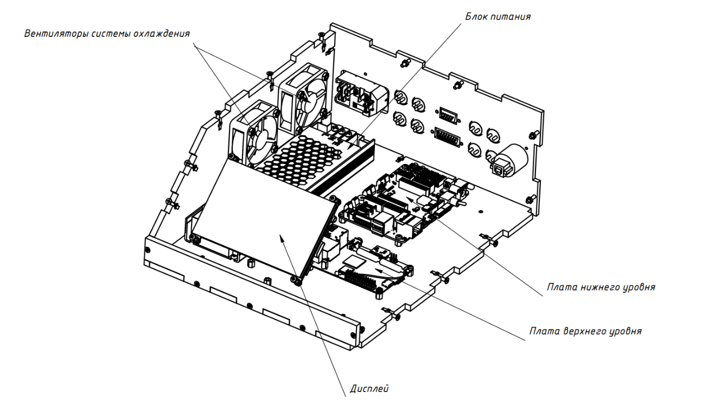
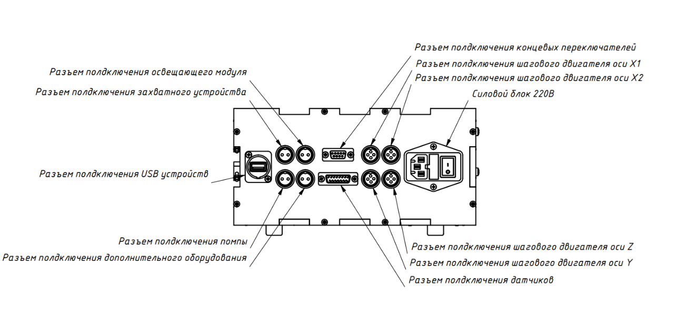

Обзор конструкции блока
=======================

Общие сведения
--------------

Блок управления предназначен для защиты управляющей электроники от внешних воздействий, а также для правильной работы ``систем охлаждения``, для организации всех электрических соединений и для защиты людей от поражения электрическим током. Блок управления поставляется в собранном состоянии. Разборка блока управления не допускается во избежание поражения электрическим током.

Блок управления включает в себя следующие конструктивные элементы: 

- Несущий корпус 

- Сборка управляющих плат 

- Дисплейный модуль 

- Блок питания 

- Вентиляторы системы охлаждения 

- Разъемы подключения исполнительных механизмов и датчиков. 

- Силовой блок 220 вольт, который включает себя розетку, предохранитель и выключатель. 

- Расположение элементов в корпусе представлено на рисунках 1-2.

Блок питания
------------

Блок питания предназначен для преобразования сетевого переменного напряжения 220 вольт в постоянное напряжение 12 вольт, необходимое для работы электроники агронабора. Преобразование напряжения 12 вольт в 5 вольт, которое необходимо для питания датчиков, дисплея и контроллера верхнего уровня выполняется платой контроллера нижнего уровня 

Система охлаждения
------------------

Вентиляторы предназначены для отвода тепла от электронных компонентов, которые нагреваются во время работы. К таким компонентам относятся блок питания, драйвера шаговых двигателей и контроллер верхнего уровня. 

Дисплей
-------

Дисплейный модуль предназначен для отображения графического интерфейса контроллера верхнего уровня. Разрешение дисплея 800х480 пикселей, диагональ 5 дюймов. Дисплей оснащен сенсорной панелью, что позволяет пользователю взаимодействовать с интерфейсом. 

Платы
-----

Сборка плат представляет собой платы контроллеров ``верхнего`` и ``нижнего`` уровней, соединенные электрически и механически. Подробнее о плате нижнего уровня рассказывается в части 2. Контроллер верхнего уровня — это одноплатный компьютер ``Raspberry PI 4B``. Компьютер работает под управлением операционной системы ``Linux``, что позволяет пользователю легко и быстро взаимодействовать с контроллером нижнего уровня, а также писать различные скрипты для управления всем агронабором. Также контроллер верхнего уровня может применяться для обновления программного обеспечения контроллера нижнего уровня.

Видео сборка блока управления: ``https://youtu.be/c5knPjMJaqk?si=24shThXHJ16EZKFy``