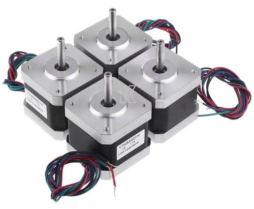
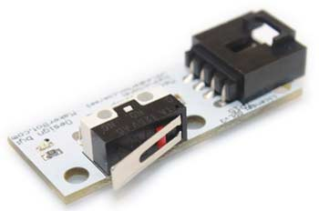
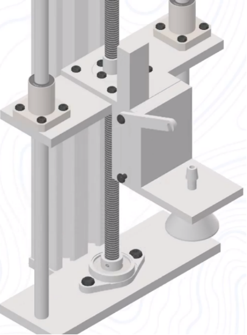
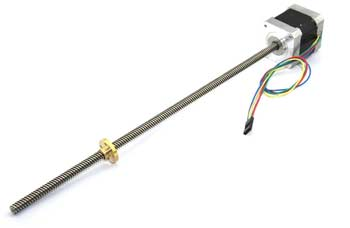

Обзор общей конструкции 
=======================

Общие сведения
--------------

Промышленный робот – это робот, предназначенный для помощи людям и замены людей на производстве. Чаще всего на производстве встречаются так называемые роботы-манипуляторы.

Манипулятор – механизм для управления пространственным положением орудий, объектов труда и конструкционных узлов и элементов. Это значение закрепилось за словом с середины XX века, благодаря применению сложных механизмов для манипулирования опасными объектами в атомной промышленности. Используется для выполнения работ в средах, недоступных или опасных для человека (подводные глубины, вакуум, радиоактивная среда и другие агрессивные среды), вспомогательных работ в промышленном производстве, получил широкое развитие в современном обществе. Попросту говоря, манипулятор – это робо-рука, способная точнее, быстрее, эффективнее (чем человек) выполнять работу на производстве – сборку, сварку, фасовку, переноску грузов и т.д. Манипуляторы также используются и в других областях, таких как космонавтика, медицина, исследования, однако наиболее широкое распространение нашли в промышленности. Манипуляторы изучает теория манипуляторов, которая является разделом теории машин и механизмов.

Основу манипуляторов составляют пространственные механизмы со многими степенями свободы. Степень свободы – это совокупность независимых координат перемещения и/или вращения, полностью определяющая положение системы или тела. Проще всего понять, что такое степень свободы, на примере – точка, находящаяся в трехмерном пространстве, имеет 3 степени свободы, так как может поступательно перемещаться в направлении трех декартовых осей – X, Y, Z. Эти координаты полностью определяют положение точки в пространстве, а также все ее возможные перемещения. Однако же, если рассматривать положение в пространстве какого-либо тела, то степеней свободы у него будет 6 – к поступательным степеням свободы добавятся вращательные, определяющие ориентацию тела, то есть степень поворота тела вокруг всех трех осей – X, Y, Z. В качестве устройств, обеспечивающих подвижность манипуляторов, чаще всего используются электроприводы вращения, которые обеспечивают одну вращательную степень свободы. Стоит отметить, что также иногда используются и линейные пневмо- и гидроприводы, обеспечивающие поступательную степень свободы

`Видео сборка робота Агролаба <https://youtu.be/IVeKcFi286I?si=MKhBDjN0Y1ZTXi2M>`_

.. figure:: images/6.png
       :width: 100%
       :align: center
       :alt: блока

`Сборка оси Х <https://youtu.be/Y48oDRDtyoc?si=msXHgRvjV-h7D88t>`_

Рама манипулятора
-----------------

То, что соединяет все элементы в единое целое, называется рамой. Форма рамы, и особенно материал, из которого она изготовлена, довольно сильно влияют на точность и качество ориентирования в пространстве. Конструкция рамы, основанная на принципе слотов, когда пластиковые детали нарезанные лазером, напечатанные на 3d принтере детали соединяются гребнями в пазы, а потом скручиваются болтами и гайками, упрощает сборку Агролаба и является более точной для калибровки.

`Сборка осей У и Z <https://youtu.be/nJm3BKMu_qg?si=5QXqvyA6z2wNE0h2>`_

Шаговые двигатели
-----------------

Есть условное обозначение типоразмера стандартного посадочного места для различных шаговых двигателей, которое имеет размеры NEMA 17 - 1.7x1.7 дюйма (43.2x43.2 мм). Меньший типоразмер обозначается как NEMA 14 (1.4x1.4 дюйма или 35.6x35.6 мм).

Шаговые двигатели могут иметь три режима работы: полношаговый, полушаговый и микрошаговый. Во время полношагового режима шаговый двигатель проворачивает свою ось на 360 градусов, совершая 200 шагов, во время полушагового - 400, а в микрошаговом режиме каждый шаг делится еще на 4, 8 или 16 частей. Управление двигателем в микрошаговом режиме настолько сложное, что для него используются специальные контроллеры шаговых двигателей. Шаговые двигатели бывают рассчитаны на 4, 8 и 12 В.

Концевые датчики
----------------

Диапазон движения линейных приводов обычно ограничивается механическими или оптическими фиксаторами – простейшими концевыми датчиками (EndStop), которые сигнализируют о приближении рукава  к краю рабочей поверхности, чтобы предотвратить выход ее за рамки платформы. Фиксаторы также используются для определения начала координат (0,0,0) по всем трем осям.

Строго говоря, наличие фиксаторов не является обязательным в работе Агролаба, но их наличие позволяет калибровать принтер перед началом работы, что делает посадку более точной и аккуратной. Концевые датчики бывают двух видов: нажимные и оптические. Оптические являются более точными, но для упрощения (например, по X-Y осям) можно воспользоваться и нажимными.

Рукав со сменными насадками для различных аграрных работ
--------------------------------------------------------

Рукав двигается при помощи линейного двигателя, состоит из двух опорных штырей, и  конструкции крепления для фиксации опусквания и подьема разных органов взаимодействия с культурой.

Рабочие насадки легко заменить удобным способом открытия и закрытия крепежа.

Линейный двигатель
------------------

Используемый привод (линейный мотор) во многом определяет точность и скорость работы, а также периодичность обслуживания Агролаба. Обычно используются гладкие, высокоточные металлические стержни для каждой оси, а также пластиковые или бронзовые шарикоподшипники для перемещения по каждому стержню. Линейные шарикоподшипники обеспечивают более долговечную и качественную работу, однако они более шумные, чем бронзовые, которые, в свою очередь, сложнее откалибровать на момент сборки.

