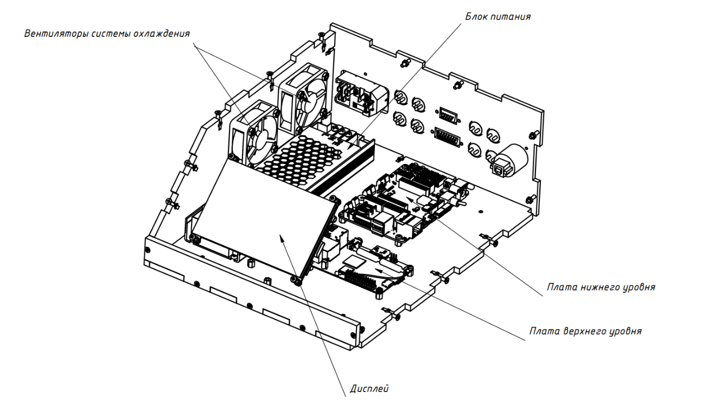
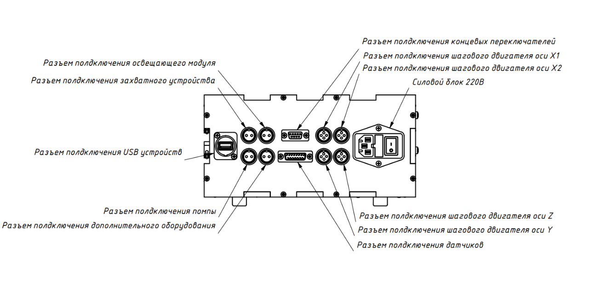
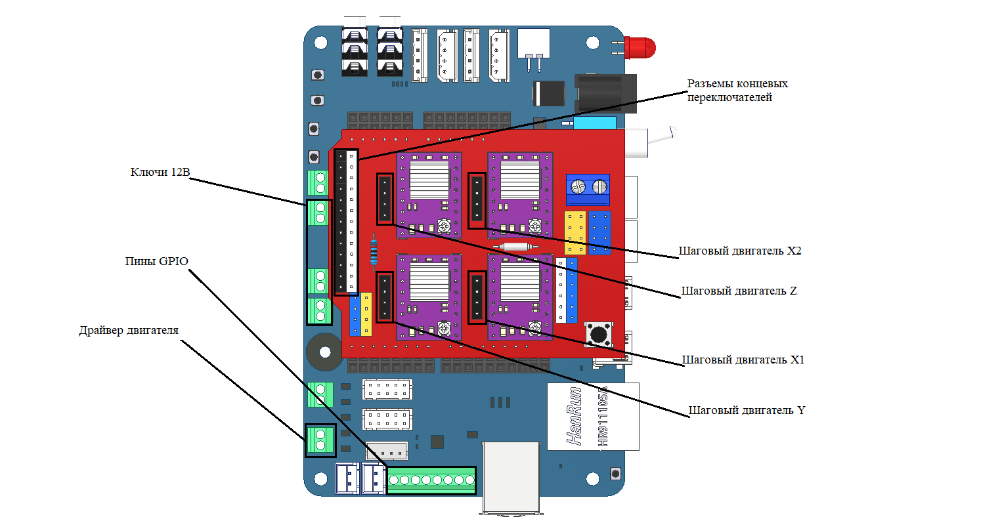
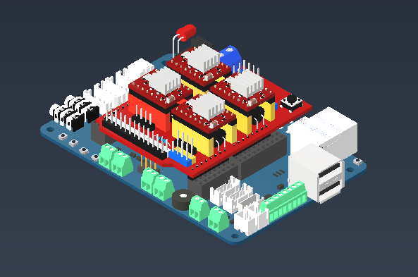
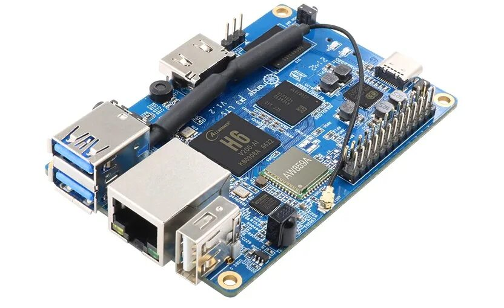

Обзор конструкции блока
=======================

Общие сведения
--------------

Блок управления предназначен для защиты управляющей электроники от внешних воздействий, а также для правильной работы ``систем охлаждения``, для организации всех электрических соединений и для защиты людей от поражения электрическим током. Блок управления поставляется в собранном состоянии. Разборка блока управления не допускается во избежание поражения электрическим током.

Блок управления включает в себя следующие конструктивные элементы: 

- Несущий корпус 

- Сборка управляющих плат 

- Дисплейный модуль 

- Блок питания 

- Вентиляторы системы охлаждения 

- Разъемы подключения исполнительных механизмов и датчиков. 

- Силовой блок 220 вольт, который включает себя розетку, предохранитель и выключатель. 

- Расположение элементов в корпусе представлено на рисунках 1-2.

Блок питания
------------

Блок питания предназначен для преобразования сетевого переменного напряжения 220 вольт в постоянное напряжение 12 вольт, необходимое для работы электроники агронабора. Преобразование напряжения 12 вольт в 5 вольт, которое необходимо для питания датчиков, дисплея и контроллера верхнего уровня выполняется платой контроллера нижнего уровня 

Система охлаждения
------------------

Вентиляторы предназначены для отвода тепла от электронных компонентов, которые нагреваются во время работы. К таким компонентам относятся блок питания, драйвера шаговых двигателей и контроллер верхнего уровня. 

Дисплей
-------

Дисплейный модуль предназначен для отображения графического интерфейса контроллера верхнего уровня. Разрешение дисплея 800х480 пикселей, диагональ 5 дюймов. Дисплей оснащен сенсорной панелью, что позволяет пользователю взаимодействовать с интерфейсом. 

Контроллеры
-----------

Сборка плат представляет собой платы контроллеров ``верхнего`` и ``нижнего`` уровней, соединенные электрически и механически. Подробнее о плате нижнего уровня рассказывается в части 2. Контроллер верхнего уровня — это одноплатный компьютер ``Raspberry PI 4B``. Компьютер работает под управлением операционной системы ``Linux``, что позволяет пользователю легко и быстро взаимодействовать с контроллером нижнего уровня, а также писать различные скрипты для управления всем агронабором. Также контроллер верхнего уровня может применяться для обновления программного обеспечения контроллера нижнего уровня.

`Видео сборка блока управления <https://youtu.be/c5knPjMJaqk?si=24shThXHJ16EZKFy>`_

Плата контроллера нижнего уровня 
--------------------------------

Общие сведения
~~~~~~~~~~~~~~

Плата представляет собой контроллер нижнего уровня, то есть принимает команды от контроллера верхнего уровня и генерирует управляющие сигналы для исполнительных устройств, а также опрашивает датчики и передает данные с них на контроллер верхнего уровня в понятном ему виде. 

**Плата включает в себя:**

- 4 канала управления шаговыми двигателями 

- Канал управления коллекторным мотором 

- 4 силовых выхода 12 вольт  

- 3 канала концевых выключателей

- 5 входов/выходов общего назначения

- USB-разъем подключения контроллера верхнего уровня

- Группу разъемов для подключения платы управления шаговыми двигателями

- Расположение основных элементов платы представлено на рисунке 1

Выводы общего назначения предназначены для подключения различных датчиков и исполнительных устройств, таких как светодиодные модули, ``пьезоизлучатели`` и прочие маломощные устройства. 

Разъемы ``концевых выключателей`` — специальная группа разъемов, к которым подключаются концевые выключатели. 

Выход на ``коллекторный мотор`` предназначен для управления маломощным коллекторным мотором, который применяется в захвате агронабора. Полярность выходного напряжения на этом разъеме может меняться для обеспечения реверса мотора. Для формирования напряжений на этом разъеме также применяется драйвер, и для управления им также требуется 2 сигнала — EN, IN. Сигнал EN аналогичен сигналу EN в драйверах шаговых двигателей, но этот сигнал можно использовать для управления скоростью вращения двигателя при помощи ШИМ. Сигнал IN отвечает за выбор направления вращения, выбирая значение между 1 или 0 – можно выбрать в какую сторону будет происходит вращение. 

Управляемые выходы 12V предназначены для управления нагрузкой высокой мощности, например, ``светодиодной лентой``, ``мотором помпы`` или ``лазером``. 

Разъем подключения контроллера верхнего уровня предназначен для подключения различных одноплатных компьютеров. Для связи контроллеров между собой применяется интерфейс USB. 

Уровни манипулятора
-------------------

**Нижний уровень**

Уровень оборудования (входов/выходов- Input/Output-level). Это уровень датчиков(sensors), измерительных устройств, контролирующих управляемые параметры, а также исполнительных устройств (actuators), воздействующих на эти параметры процесса, для приведение их в соответствие с заданием. На этом уровне осуществляется согласование сигналов датчиков с входами устройства управления, а вырабатываемых команд с исполнительными устройствами.

**Средний уровень**

Уровень управления оборудованием-Control level. Это уровень контроллеров (ПЛК-PLC, Programable Logic Controller). ПЛК получает информацию с контрольно-измерительного оборудования и датчиков о состоянии технологического процесса и выдает команды управления, в соответствии с запрограммированным алгоритмом управления, на исполнительные механизмы.

В наборе нижний и средний уровни объединены в сборке, состоящей из платы управления нижнего уровня и платы управления шаговыми двигателями. Сборка представлена на рисунке.

**Верхний уровень** 

Уровень промышленного сервера, сетевого оборудования, уровень операторских и диспетчерских станций. На этом уровне идет контроль хода производства: обеспечивается связь с нижними уровнями, откуда осуществляется сбор данных, визуализациия и диспетчеризациия (мониторинг) хода технилогического процесса.  Это уровень HMI, SCADA. На этом уровне задействован человек, т.е. оператор (диспетчер). Он осуществляет локальный контроль технологического оборудования через так называемый человеко-машинный интерфейс (HMI - Human Machine Interface). К нему относятся: мониторы, графические панели, которые устанавливаются локально на пультах управления и шкафах автоматики. 

Для осуществления контроля за распределенной системой машин, механизмов и агрегатов применяется SCADA (Supervisory Control And Data Acqusition - диспетчерское управление и сбор данных) система. Эта система представляет собой порграммное обеспечение, которое настраивается и устанавливается на диспетчерских компьютерах. Она обеспечивает сбор, архивацию, визуализацию, важнейших данных от ПЛК. При получении данных система самостоятельно сравнивает их с заданными значениями управляемых параметров (уставками) и при отклонении от задания уведомляет оператора с помощью тревог(Alarms), позволяя ему предпринять необходимые действия. При этом система записывает все происходящее, включая действия оператора, обеспечивая контроль действий оператора в случае аварии или другой нештатной ситуации. 

Таким образом, обеспечивается персональная ответственность управляющего оператора.

Контроллер верхнего набора представлен одноплатным компьютером Orange Pi 3 LTS, который показан на рисунке

