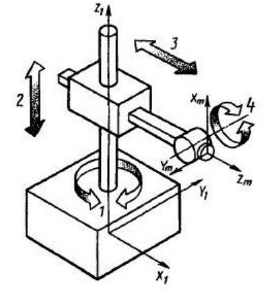

Прямая и обратная задачи кинематики
===================================

Промышленный робот, действующий в прямоугольной, или декартовой, системе координат (рис. 1), имеет ``три поступательных базовых степени подвижности`` с взаимно перпендикулярными направлениями перемещений. Этот тип робота состоит из рамы в виде балочной, мостовой или портальной конструкции, перемещающейся поступательно, поперечной тележки или каретки, относительно которой в вертикальном направлении перемещается "рука" манипулятора в виде стойки или колонны. Форма образующейся пространственной фигуры, описываемой рабочим органом, так называемой рабочей зоны, представляет собой прямоугольный параллелепипед

.. figure:: images/1.png
       :width: 60%
       :align: center
       :alt: задачи кинематики

       Рис. 1. Робот, работающий в прямоугольной системе координат 

Механические свойства прямоугольной системы манипулятора (удобство обслуживания рабочей зоны, достаточно высокая жесткость) позволяют применять такие роботы в стесненных условиях, подвешивая их над обслуживаемым оборудованием, а также там, где требуется высокая точность, например, на сборочных операциях. Однако, несмотря на сравнительную простоту построения манипулятора и программирования, промышленные роботы такой конструкции используются сравнительно редко. Недостатками являются чрезмерное увеличение габаритных размеров устройства при сравнительно небольшом объеме рабочей зоны и удлинение продолжительности заданной циклограммы процесса. Чаще всего такие роботы выполняются в виде каретки, подвешенной на направляющих под или над обслуживаемым оборудованием, либо в виде портальной конструкции. 

Промышленный робот, действующий в цилиндрической системе координат (рис. 2), имеет ``одну вращательную`` и ``две поступательные`` базовые степени подвижности с взаимно перпендикулярными направлениями перемещений. Манипулятор такого робота состоит из поворотной колонны, или стойки, перемещающейся по ней в вертикальном направлении каретки, относительно которой поступательно движется "рука" манипулятора. Форма образующейся рабочей зоны представляет собой неполный цилиндр

       Рис. 2. Робот, работающий в цилиндрической системе координат 

Благодаря удобству конструктивного построения и программирования, такая конфигурация манипулятора получила широкое распространение. Она обеспечивает обслуживание большого объема рабочего пространства, а наличие двух переносных поступательных перемещений наряду с вращательным облегчает планировку и компоновку рабочих мест и оборудования, создание робототехнических комплексов. К недостатку следует отнести затруднительность обслуживания объектов, расположенных на малой высоте. 