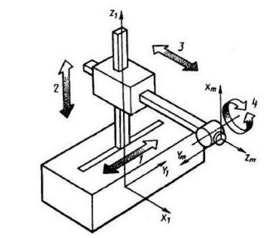

Прямая и обратная задачи кинематики
===================================

Промышленный робот, действующий в прямоугольной, или декартовой, системе координат (рис. 1), имеет три поступательных базовых степени подвижности с взаимно перпендикулярными направлениями перемещений. Этот тип робота состоит из рамы в виде балочной, мостовой или портальной конструкции, перемещающейся поступательно, поперечной тележки или каретки, относительно которой в вертикальном направлении перемещается "рука" манипулятора в виде стойки или колонны. Форма образующейся пространственной фигуры, описываемой рабочим органом, так называемой рабочей зоны, представляет собой прямоугольный параллелепипед

       Рис. 1. Робот, работающий в прямоугольной системе координат 

