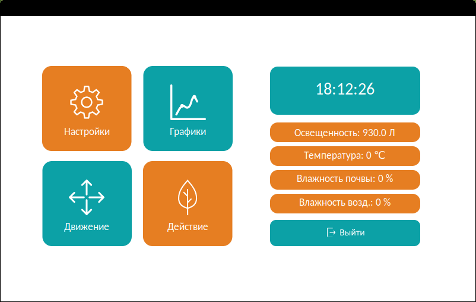
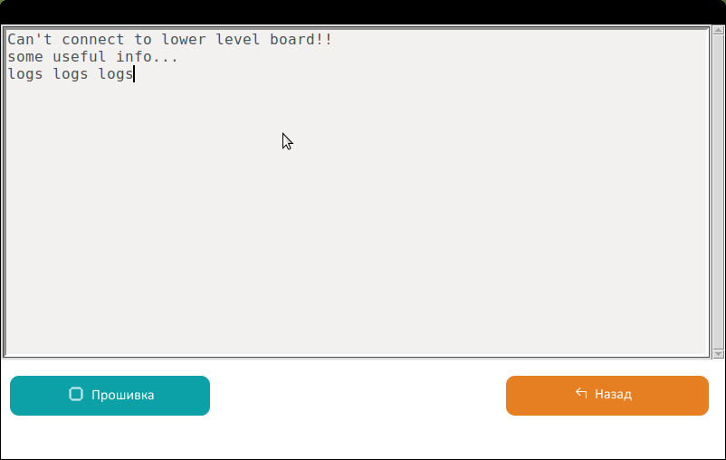
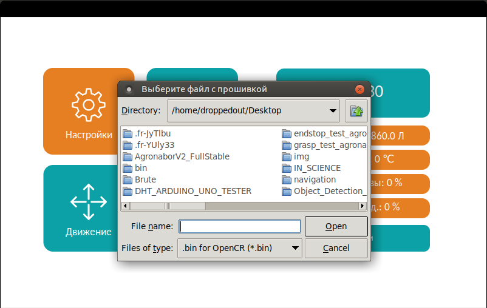
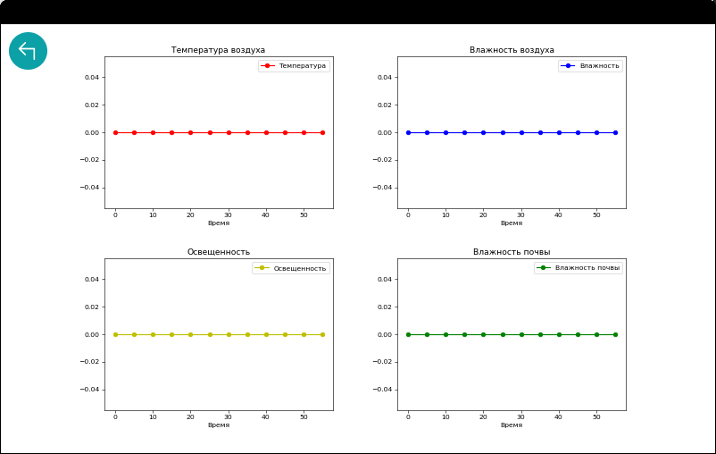

Обзор доступного нам интерфейса
===============================

Общие сведения 
--------------

После включения образовательного набора произойдет загрузка операционной системы на контроллере верхнего уровня и запуск графического интерфейса пользователя. На нем представлены::

    - Текущее время (автоматически обновляется после подключения набора к интернету)

    - В правом столбце - показания датчиков, установленных на набор

    - Кнопка “Выйти” – завершение работы интерфейса

    - Кнопка “Настройки” – форма с настройками

    - Кнопка “Графики” - форма с графиками, построенными на основании показаний датчиков

    - Кнопка “Действие” – выбор режима работы набора

    - Кнопка “Движение” – ручное перемещение по осям

Настройки
---------

Большую часть окна занимает консоль, в которую в режиме реального времени выводятся пакеты, присылаемые платой нижнего уровня, помогает отладить загруженную в нее программу. В случае, если связь с платой нижнего уровня невозможно, в консоль будет выведено сообщение “Can’t connect to lower level board!!!”, как показано на скриншоте.

В нижней части окна расположены:

- Кнопка “Назад” – возврат на предыдущую форму

- Кнопка “Прошивка” – загрузка программного кода в плату нижнего уровня
       

Графики
-------

После нажатия кнопки “Графики” на главном окне интерфейса, после отображения экрана загрузки, откроется форма, содержащая графики, построенные по показаниям датчиков. Обновление графиков происходит в режиме реального времени с интервалом раз ~10 секунд.

При нажатии на кнопку в верхнем левом углу экрана происходит возврат на главную форму интерфейса. 

В случае если в окне “Графики” значения на одном и графиков не обновляются или равняются нулю, следует проверить правильность подключения датчиков к блоку управления набором и работоспособность датчиков.

Движение
--------

При нажатии кнопки “Движение”, откроется форма для ``ручного`` передвижения каретки. В левом столбце расположены 3 кнопки “HOME X”, “HOME Y”, “HOME Z”, каждая из которых отправляет каретку в домашнее положение по одной из осей. Кнопка “HOME ALL” отправляет каретку в домашнее положение по трем осям последовательно. Треугольные кнопки вокруг “HOME ALL” двигают каретку на заданное количество шагов в соответствующем направлении по осям X или Y. Треугольные стрелки вверх и вниз в правой части экрана двигают каретку по оси Z на заданное количество шагов. Количество шагов задается нажатием одной из круглых кнопок с числами в нижней части экрана, число на кнопке соответствует количеству шагов. Кнопки “Lock STP” и “Unlock STP” переводят шаговые двигатели в режим удержания и отключают этот режим соответственно. Перемещение каретки руками возможно только при отключенном режиме удержания.

В правом верхнем углу экрана выводятся координаты X, Y, Z каретки с инструментом.

При нажатии на круглую кнопку со стрелкой в правом нижнем углу осуществляется переход на главную форму.

Действие
--------

При нажатии кнопки “Действие” происходит переход в окно с выбором режима работы набора.

  ::
    
    “Полив” – производит полив посаженных растений. Перед включением убедитесь в установке насадки “пульверизатор”, подключения к ней шланга и наличия воды в баке.

    “Высверливание” – выкапывание ямок для посадки растений. Перед включением убедитесь в установке насадки “бур”.

    “Освещение” – включение/выключение фитолент.

    “Домой” – отправляет каретку в домашнее положение по всем осям.

    “Лазер” – производит выжигание сорняков лазером по координатам (для комплектаций, содержащих лазер). Перед включением убедитесь в установке и подключении модуля лазера к блоку управления.

    “Сбор” – производит сбор растений по координатам и складывает их на бак с водой. Перед включением убедитесь в установке захватного устройства и подключении его питания. Перед началом работы захватное устройство должно быть закрыто.

    “Влажность” – производит замер влажности почвы в ямках для посадки растений. Перед включением убедитесь в установке насадки “датчик влажности почвы” и ее подключении

    “Посадка” – производит посадку семян из контейнера в ямки, подготовленные предыдущими операциями. Перед включением убедитесь в установке захватного устройства и подключении его питания. Перед началом работы захватное устройство должно быть закрыто.
