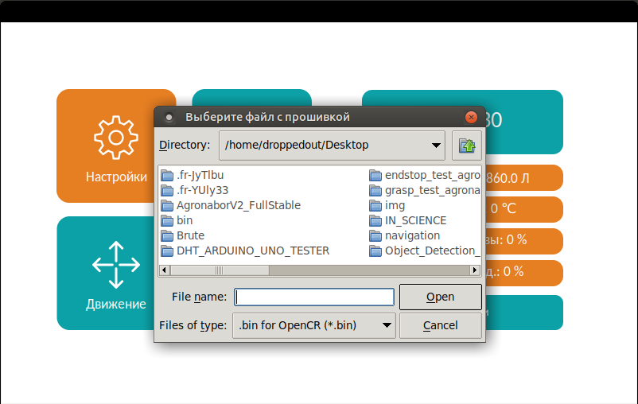

Прошивка платы нижнего уровня
=============================

При нажатии в окне ``“Настройки”`` кнопки ``“Прошивка”`` откроется диалоговое окно, в котором нужно выбрать файл для загрузки в плату нижнего уровня. Диалоговое окно позволяет выбрать только файлы с ``расширением bin``, в плату возможно загрузить только предварительно скомпилированный код. 

Для выбора файла, находящегося на flash – карте необходимо перейти в папку::

    /media/orangepi/название-flash-карты 

и выбрать соответствующий файл. Далее требуется нажать кнопку “Open”, после этого начнется загрузка в плату, появится экран загрузки. После завершения загрузки отобразится главная страница графического интерфейса. 