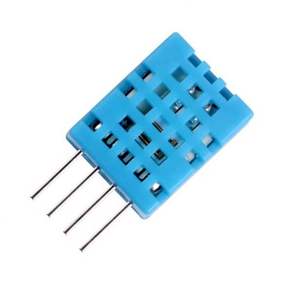
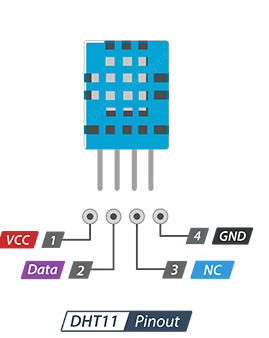
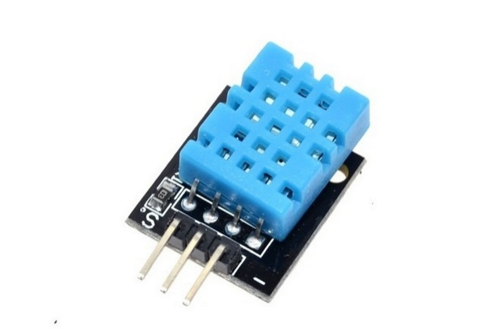
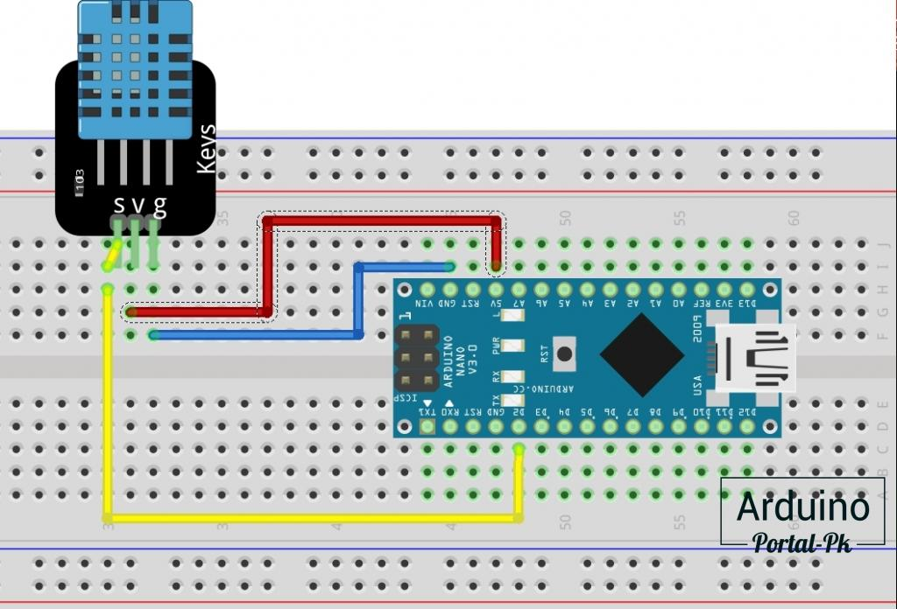
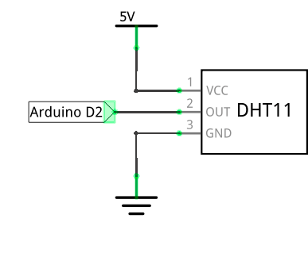
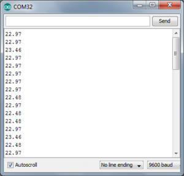
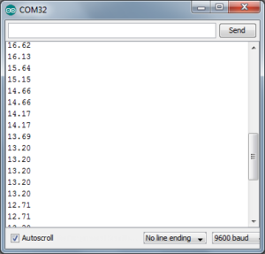

Датчик DHT11
============

Еще один полезный прибор, который часто используется в современных устройствах 

- это датчик температуры. Даже в вашем компьютере есть сразу несколько датчиков температуры, с помощью которых система следит за перегревом ключевых компонентов

- процессора, видеокарты, блока питания, и прочих узлов. Самый же популярный пример использования датчика температуры дома — термостат. Это устройство, которое постоянно следит за температурой воздуха, и регулирует подачу энергии в систему отопления. Смежный пример — котел для нагрева воды.

Мы используем датчик DHT11. Вместо него можно использовать любой другой похожий датчик: DHT21, DHT22 и подобные. Выглядит датчик следующим образом:

Датчик имеет следующие характеристики:

- напряжение питания: от 3,5 до 5,5 В; 

- погрешность: 2 градуса;

- измеряемая температура: от 0°C до 50°C

- потребляемый ток: 300 мкА.

Подключение
-----------

Датчик DHT11 имеет 4 вывода Назначение выводов представлено на рисунке.

В комплекте датчик представлен в виде готового модуля – платы, на которой распаян датчик и вся необходимая обвязка. Внешний вид тмодуля представлен на рисунке.

       Внешний вид макета

       Принципиальная схема 

Вот так должна выглядеть собранная схема.

Программирование 
----------------

Подключив датчик температуры к Ардуино, начинаем писать программу. Первое что мы сделаем, это выведем необработанный сигнал с аналогового входа в последовательный порт, для того чтобы просто понять, как меняется значение на входе A0. Нам понадобится простая программа::

    int raw = 0;
    float temp = 0;
     
    void setup() {
        Serial.begin(9600);
        pinMode( A0, INPUT );
    }
     
    void loop() {
        raw = analogRead(A0);
        temp = ( raw/1023.0 )*5.0*1000/10;
        Serial.println(temp);
        delay(1000); 
    }

В программе можно заметить выражение::

    temp = ( raw/1023.0 )*5.0*1000/10;

Оно необходимо для того, чтобы преобразовать аналоговый сигнал датчика в градусы Цельсия. Дело тут вот в чем. Все аналоговые датчики имеют важную характеристику — отношение количества вольт к единице измеряемой величины. Например, в спецификации к нашему датчику tmp35 написано, что каждый градус измеряемой температуры, соответствует 10 милливольтам напряжения на выходе. Исходя из этих рассуждений, прочитанное с помощью analogRead значение мы сначала преобразуем к количеству Вольт::

    вольты = (значение АЦП / 1023) * 5

Такая процедура называется нормировкой. Здесь 1023 — максимальное значение, которое может вернуть нам 10-битный АЦП, встроенный в Ардуино Уно.
5 — рабочее напряжение АЦП.
Затем преобразуем эти вольты в градусы Цельсия::

    градусы = (вольты * 1000) / 10

Превращаем вольты в милливольты (*1000), и делим на 10 ( то самое число из спецификации! ).

Загружаем программу на Ардуино и наблюдаем за температурой окружающего воздуха. Например, у нас в лаборатории датчик оценил температуру следующим образом:

Вполне себе правдивое значение. А теперь поднесем прибор к открытому окну (на улице зима -10°C):

.. raw:: html

    

        <iframe src="https://www.youtube.com/embed/XqwhYPEjNJA?si=ZVftNdfa8SJub7w6" frameborder="0" allowfullscreen style="position: absolute; top: 0; left: 0; width: 100%; height: 100%;"></iframe>
    

