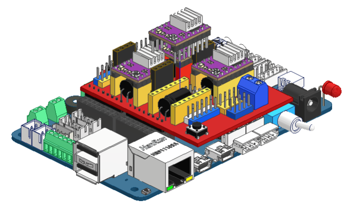

Управление шаговыми двигателями
===============================

Общие сведения
--------------

Рабочий орган набора способен передвигаться по трем осям: X, Y и Z. Движение по осям происходит с помощью шаговых двигателей. Особенность шаговых двигателей заключается в том, что для них определено количество шагов на оборот, т.е. чтобы вал двигателя провернулся один раз, он должен совершить 200 шагов, контроллер, соответственно должен отправить 200 импульсов. Такие двигатели позволяют очень точно позиционировать рабочий орган. Чтобы управлять ими, используются специальные микросхемы, называемые драйверами двигателей. Они устанавливаются в гнезда микроконтроллера, показанные на рисунке: 

Чтобы запрограммировать микроконтроллер на управление шаговыми двигателями, нам потребуется настроить 3 пина на режим работы OUTPUT, один пин будет управлять наличием тока на двигателях (включены двигатели или выключены), второй будет контролировать направление движения моторов (HIGH, например, по часовой стрелке, LOW – против часовой, или наоборот, направление зависит от подключения двигателя). На третий пин надо будет подавать сигнал, чтобы он совершил один шаг. Создадим 3 директивы препроцессора для обозначения номеров этих пинов. Сделать это можно с помощью команды #define, затем указывается имя директивы и значение, например: #define STEP_ENABLE 29. Объявить их нужно в глобальной области, т.. вне всех функций. Таким образом, к ним можно будет обратиться из любой функции. 

Код будет выглядеть следующим образом::

    #define STEP_ENABLE 8
    #define STEP_PIN_X 2
    #define DIR_PIN_X 5

    void setup() {
    }

    void loop() {
    }

``STEP_ENADLE`` – директива препроцессора, содержащая номер пина, который включает питание на шаговых двигателях. 

``STEP_PIN_X`` – директива препроцессора, содержащая номер пина, на который надо подать сигнал, чтобы шаговый двигатель сделал один шаг. 

``DIR_PIN_X`` – директива препроцессора, содержащая номер пина, который контролирует направление вращения вала двигателя. 

Напишем программу, которая заставит вал шагового двигателя совершить ровно один оборот для этого настроим пины на OUTPUT в функции setup и допишем цикл for. В функциях pinMode теперь можно использовать директивы препроцессора, они нужны нам для упрощенного запоминания номера пина и функции, за которую он отвечает. 

Затем потребуется включить питание двигателей, с помощью команды digitalWrite(STEP_ENABLE,HIGH); и задать направление вращения вала командой  digitalWrite(DIR_PIN_X,LOW); После этого нужно отправить 200 сигналов на шаговый двигатель, чтобы не писать 200 строк, можно воспользоваться циклом for. В круглых скобках после for создается переменная – счетчик (int i=0), указывается условие выхода из цикла (i < 200, т.е. цикл выполнился 200 раз), изменение счетчика за один шаг цикла (i++, т.е. счетчик увеличивается на единицу). В теле цикла (в фигурных скобках) указывается действие, которое должно выполниться несколько раз. В данном случае нужно сначала выставить на пине значение ``HIGH``, потом, через небольшую задержку (delayMicroseconds(1000)- 1000 микросекунд) надо выставить на пине значение LOW, и опять добавить задержку. Полный код будет выглядеть следующим образом:: 

    #define STEP_ENABLE 8
    #define STEP_PIN_X 2
    #define DIR_PIN_X 5

    void setup() {
     pinMode(STEP_ENABLE,OUTPUT);
     pinMode(STEP_PIN_X,OUTPUT);
     pinMode(DIR_PIN_X,OUTPUT);
     digitalWrite(STEP_ENABLE,HIGH);
     digitalWrite(DIR_PIN_X,LOW); 
     for(int i = 0; i < 200; i++) 
     {
     digitalWrite(STEP_PIN_X,HIGH); 
     delayMicroseconds(1000); 
     digitalWrite(STEP_PIN_X,LOW); 
     delayMicroseconds(1000); 
     }
    }
     
    void loop() {
    }

В результате выполнения этого кода, вал должен совершить ровно ``один оборот``. Изменяя номера пинов в директиве препроцессора и загружая программу в плату, можно проверить двигатели по всем осям. 
