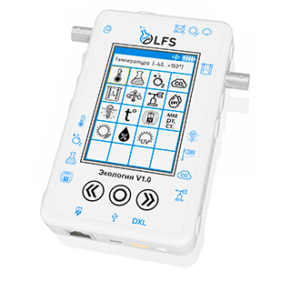
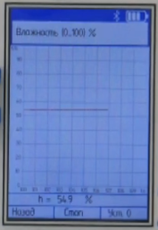

Обзор блока PolusLab
--------------------

Общая информация
~~~~~~~~~~~~~~~~

Цифровые лаборатории, представляют собой комплекты, выполненные на базе многофункциональных устройств регистрации и сбора данных ``LFS``, содержащих встроенные сенсорные устройства, подключаемые внешние датчики и цифровые интерфейсы для подключения внешних устройств, в том числе для коммуникации с внешними программируемыми контроллерами. 

Такое устройства блока позволяет использовать лабораторию как модуль робототехнической системы, в обязанности которой входит жесткий мониторинг таких состояний среды как относительная ``влажность``, ``pH``, ``атмосферное давление`` и т.п.

Беспроводной мультидатчик LFS представляет собой многофункциональное устройство регистрации и сбора данных. Он оснащен цветным сенсорным экраном для отображения числовой и графической информации о результатах измерений.

Для передачи результатов измерений на внешние ПК или мобильные устройства можно применить ``беспроводной протокол Bluetooth``. 

Состав комплекта
~~~~~~~~~~~~~~~~

Рассматриваемый комплект ``Экология v1.0`` включает в себя набор датчиков:

1. Датчик атмосферного давления;

2. Датчик освещенности (люксметр);

3. Датчик относительной влажности;

4. Датчик УФ излучения и ИК излучения;

5. Датчик температуры воздуха;

6. Датчик температуры;

7. Датчик pH;

8. Датчик нитрат-ионов;

9. Датчик хлорид-ионов;

10. Электрод сравнения;

11. Датчик электрической проводимости;

12. Датчик влажности почвы;

13. Датчик мутности и оптической плотности (колориметр);

14. Датчик содержания СО;

15. Датчик звука.

На блоке расположено 16 разъемов:: 

    Левый бок:
    “F-коннектор”, Jack 5.5 и четыре Jack 3.5. 
    Правый бок:
    “F-коннектор” и четыре Jack 3.5. 
    Верх:
    Jack 3.5 и оптический порт для датчиков (б) и (г).
    Низ:
    Сетевой порт, mini USB и MX-5264-03. (Также здесь расположен микрофон)

Каждый разъем предназначен только под определенный датчик, а потому они обозначены условными значками с лицевой стороны. На ней же расположены сенсорный экран и ``три кнопки управления``.

Управление блоком и вывод данных
~~~~~~~~~~~~~~~~~~~~~~~~~~~~~~~~

Управление датчиками может осуществляться различными путями. 

Сам блок уже является компьютером, способным вывести пользователю данные, полученные с подключенного оборудования на сенсорный экран. Для этого достаточно включить блок и выбрать на экране ``датчик`` (который конечно же должен быть заранее включён в соответствующий ему разъем). Тогда после нажатия кнопки старт блок начнет строить график измерений и выводить мгновенное значение в режиме ``реального времени``. 

Блок и управляющая плата
~~~~~~~~~~~~~~~~~~~~~~~~

Наиболее трудный, но при этом универсальный метод снятия информации может быть реализован через подключение MX-5264-03 порт. Подключив через шину по протоколу DXL плату управления робототехнической системы, можно сделать цифровую лабораторию дополнительными или даже основными органами чувств робототехнического аппарата. Не совсем рационально делать это для коммерческой продукции, однако, на этапе проектирования и при обслуживании или проверки конечной продукции этот инструмент может оказаться незаменим.

Связь с блоком через DXL
~~~~~~~~~~~~~~~~~~~~~~~~

.. raw:: html

    

        <iframe src="https://www.youtube.com/embed/Yh2PlsXvCBY?si=JbfwT2ZquvBILJqE" frameborder="0" allowfullscreen style="position: absolute; top: 0; left: 0; width: 100%; height: 100%;"></iframe>
    

У нас в доступе для исследования есть блок “Экология V1.0”. Применяться он будет в качестве средства ``мониторинга состояния среды Agrolab multibot`` с автоматизированной системой климат контроля (температура, состав атмосферы, состав почвы, освещенность и др.). Так как участие человека планируется минимальным, а система по своей сути представляет робота, то наиболее подходящий метод снятия информации – протокол DXL. Возможности цифровой лаборатории позволяют осуществить:

- создание необходимой прошивки для платы в самом начале проекта;

- проверку достаточности используемых методов наблюдения за средой, калибровку и подбор необходимых настроек датчиков;

- проверку возможностей готовой Agrolab multibot до установки постоянных датчиков;

- долгосрочный полевой эксперимент с возможностью удаленного наблюдения.

- сверку результатов измерений на заключительном этапе сборки проекта путем дублирования датчиков и средств обработки информации.  

**Подключение PolusLab к Agrolab multibot**

Для подключения мультидатчика PolusLab к агронабору потребуется соединить мультидатик с управляющей платой агронабора проводами ``dynamixel``.

Чтобы из программы получить данные с датчиков полюс, требуется подключить библиотеку ``DynamixelSDK``, далее создать 4 переменные для регистров в полюс лабе, с помощью которых можно будет включить отправку данных с датчиков.

1. ``LFS_CONDUCTIVITY_ID`` – id датчика, который нужно записать в регистр LFS_WRITE_ENABLED, чтобы включить считывание с этого датчика.

2. Для записи номера датчика в регистр LFS_WRITE_ENABLED, сначала надо записать 0 в регистр LFS_ENABLE_PUBLISH, чтобы полностью отключить чтение с датчиков на время включения нового.

3. После записи номера датчика, который требуется включить, в память агронабора требуется записать 1 в регистр LFS_ENABLE_PUBLISH, чтобы включить чтение со всех подключенных к полюсу датчиков.

4. Далее можно считывать показания датчика из регистра LFS_READ_DATA.

Далее создаются переменные для создания подключения по протоколу dynamixel:

- ``PROTOCOL_VERSION`` – версия протокола (для работы с полюсом используется 2).

- ``DXL_ID`` – id мультидатчика полюс в сети dynamixel, по умолчанию – 206.

- ``BAUDRATE`` – скорость обмена данными в dynamixel сети.

В функции setup создаются 2 объекта:

- ``portHandler`` используется для создания подключения, выставления скорости обмена данными и прочих настроек.

- ``packetHandler`` – для чтения и записи в регистры.

Ниже в функции setup расположен цикл ``while``, который при запуске контроллера ожидает, пока пользователь откроет последовательный порт, потом происходит попытка открытия порта dynamixel, о результатах которой в последовательный порт выводится сообщение пользователю, далее выставляется скорость обмена данными.

Затем с помощью функции ``write1ByteTxRx`` записывается 0 в регистр ``LFS_ENABLE_PUBLISH``, эта строчка отключает чтение показаний всех датчиков полюс, о результатах операции также выводиться сообщение пользователю в последовательный порт. Далее с помощью той же функции ``write1ByteTxRx`` происходит запись номера датчика, который необходимо включить в соответствующий регистр полюс лаба.

Отправка данных со всех датчиков включается и в бесконечном цикле происходит чтение показаний датчика и вывод их в консоль с интервалом в 500 мс.

::

    #include <DynamixelSDK.h>
    
    
    // Control table address
    #define LFS_CONDUCTIVITY_ID 312 // 310 311 312
    #define LFS_ENABLE_PUBLISH 24
    #define LFS_READ_DATA 80
    #define LFS_WRITE_ENABLED 60
    
    // Protocol version
    #define PROTOCOL_VERSION                2.0                 // See which protocol version is used in the Dynamixel
    
    // Default setting
    #define DXL_ID                          206                   // Dynamixel ID: 1
    #define BAUDRATE                        115200
    #define DEVICENAME                      "OpenCR_DXL_Port"   // This definition only has a symbolic meaning and does not affect to any functionality
    
    #define CMD_SERIAL                      Serial
    
    uint8_t dxl_error = 0;                          // Dynamixel error
    int32_t dxl_conductivity = 0;               // Present position
    int dxl_comm_result = COMM_TX_FAIL;             // Communication result
     
    void setup()
    {
      // Initialize PortHandler instance
    // Set the port path
    // Get methods and members of PortHandlerLinux or PortHandlerWindows
    dynamixel::PortHandler *portHandler = dynamixel::PortHandler::getPortHandler(DEVICENAME);
    
    // Initialize PacketHandler instance
    // Set the protocol version
    // Get methods and members of Protocol1PacketHandler or Protocol2PacketHandler
    dynamixel::PacketHandler *packetHandler = dynamixel::PacketHandler::getPacketHandler(PROTOCOL_VERSION);
         
      Serial.begin(1000000);
      while(!Serial);
    
      Serial.println("Start..");
    
      // Open port
      if (portHandler->openPort())
      {
        Serial.println("Succeeded to open the port!\n");
      }
      else
      {
        Serial.println("Failed to open the port!\n");
        return;
      }
    
      // Set port baudrate
      if (portHandler->setBaudRate(BAUDRATE))
      {
        Serial.println("Succeeded to change the baudrate!\n");
      }
      else
      {
        Serial.println("Failed to change the baudrate!\n");
        return;
      }
    
    
            // Disable data publish
      dxl_comm_result = packetHandler->write1ByteTxRx(portHandler, DXL_ID, LFS_ENABLE_PUBLISH, 0, &dxl_error);
      if (dxl_comm_result != COMM_SUCCESS)
      {
        Serial.println(packetHandler->getTxRxResult(dxl_comm_result));
      }
      else if (dxl_error != 0)
      {
        Serial.println(packetHandler->getRxPacketError(dxl_error));
      }
      else
      {
        Serial.println("Dynamixel has been successfully connected \n");
      }
            delay(500);
      // Enable LFS_PRESSURE
      dxl_comm_result = packetHandler->write1ByteTxRx(portHandler, DXL_ID, LFS_WRITE_ENABLED, LFS_CONDUCTIVITY_ID, &dxl_error);
      if (dxl_comm_result != COMM_SUCCESS)
      {
        Serial.println(packetHandler->getTxRxResult(dxl_comm_result));
      }
      else if (dxl_error != 0)
      {
        Serial.println(packetHandler->getRxPacketError(dxl_error));
      }
      else
      {
        Serial.println("Dynamixel device has been successfully connected \n");
      }
            delay(500);
         // Disable data publish
      dxl_comm_result = packetHandler->write1ByteTxRx(portHandler, DXL_ID, LFS_ENABLE_PUBLISH, 1, &dxl_error);
      if (dxl_comm_result != COMM_SUCCESS)
      {
        Serial.println(packetHandler->getTxRxResult(dxl_comm_result));
      }
      else if (dxl_error != 0)
      {
        Serial.println(packetHandler->getRxPacketError(dxl_error));
      }
      else
      {
        Serial.println("Dynamixel device has been successfully connected \n");
      } 
      
      while(1)
      {
            delay(500);
    dxl_comm_result = packetHandler->read4ByteTxRx(portHandler, DXL_ID, LFS_READ_DATA, (uint32_t*)&dxl_conductivity, &dxl_error);
          if (dxl_comm_result == COMM_SUCCESS)
          {
            Serial.println(packetHandler->getTxRxResult(dxl_comm_result));
            Serial.println("Conductivity:");
            dxl_conductivity/=10;
            Serial.println(dxl_conductivity);
          }
          else if (dxl_error != 0)
          {
            Serial.println(packetHandler->getRxPacketError(dxl_error));
          }
          delay(500);
      }
    }
    
    void loop()
    {
    
    }
