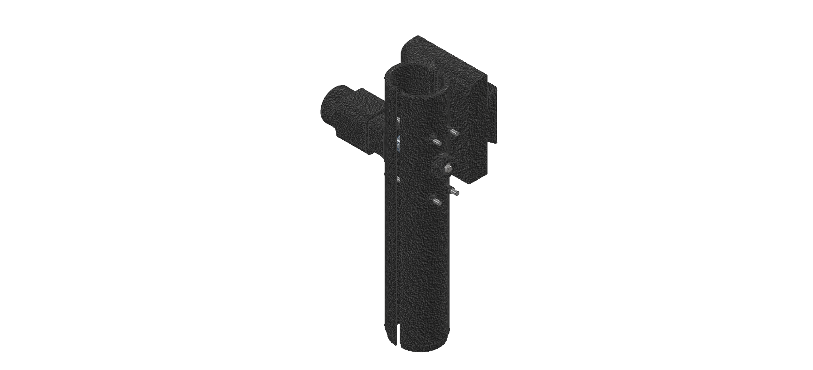
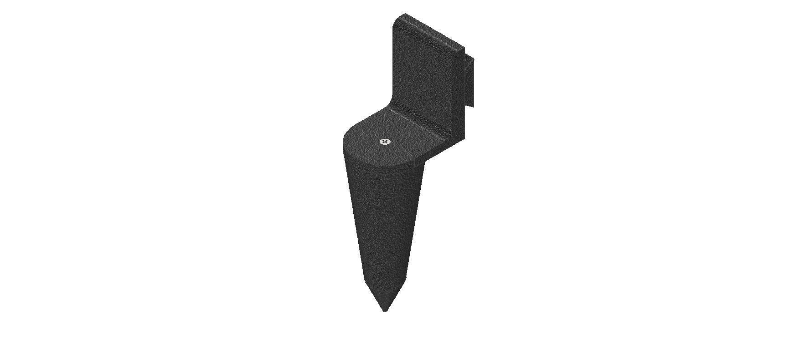
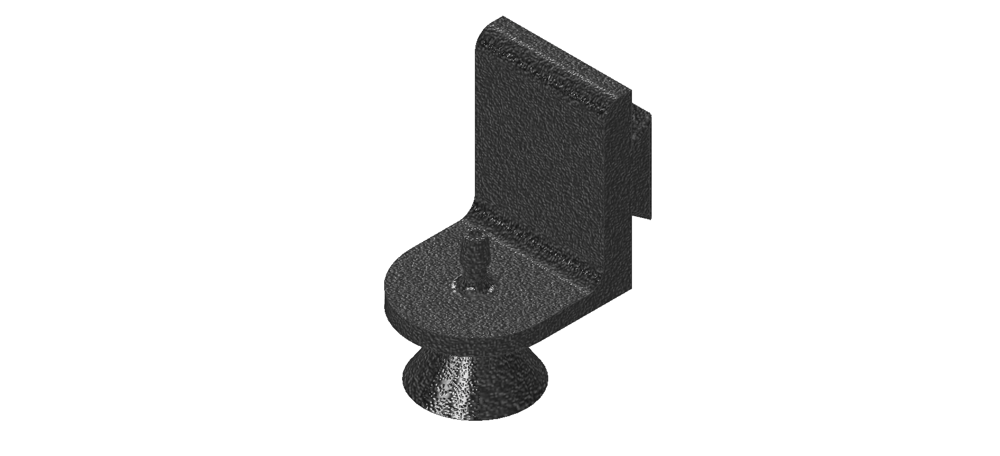

Насадки
=======

В конструкции всего образовательного модуля позиционирования для выполнения задач, присутствуют 6 сменных модулей:

1. Модуль захвата. Захват – разновидность эффектора, предназначенная для удержания и перемещения. Захват входит в прямой контакт с продуктом, поэтому важно выбрать правильный тип захвата, наиболее подходящий для целевых объектов, который сможет надежно удерживать и не повредить их. В предоставленной работе используется конструкция, которая позволяет осуществлять подъем и внедрение луковиц в почву, с учётом размеров заранее приготовленной луковицы.

Для привода используется коллекторный мотор форм-фактора 130. Такие моторы отличаются низкой ценой и малыми размерами.

2. Модуль бур. Модуль бура служит для создания лунки под посадку, а также для рыхления почвы. Данная насадка используется в тандеме с модулем захвата, заранее подготавливая лунку в почве, для последующего осуществления посадки полезной растительности.

3. Модуль лейка. Данный модуль служит для внесения в почву необходимой растениям влаги, а также при необходимости внесения жидких удобрений. Без модуля лейки невозможно осуществлять полный цикл осуществления посадки и сбора урожая. Так как для него будет необходим этап ухода за растениемя.

4. Модуль с датчиком влажности почвы. Модуль с датчиком служит для определения влажности почвы в нескольких точках. Данные операции могут понадобится для проведения лабораторных работ и ведения контроля за состоянием системы. А также для осуществления оптимизации работы и контроля временных промежутков для полива.

5. Модуль с датчиком влажности почвы Poluslab. Модуль с датчиком влажности почвы служит для определения влажности почвы в нескольких точках, но считываться данные будут с помощью модуля Poluslab. Помимо другого принципа считывания используется другой по своему устройству датчик, а именно емкостной.

6. Модуль с датчиком температуры Poluslab. Модуль с датчиком температуры служит для определения температуры почвы в нескольких точках, засчёт прямого проникновения в почву.

